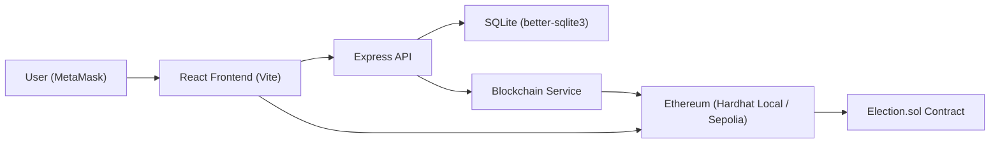

# Vox

Vox is a blockchain voting application for learning and experimentation.  
It combines a Solidity election contract with a React frontend and an Express backend.  
The system supports voter verification, admin workflows, on-chain voter registration, and vote casting.

## Stack

- Solidity (`contracts/Election.sol`)
- Hardhat (`hardhat.config.js`, deployment scripts, tests)
- React 19 + Vite 7 (`src/`)
- Express 5 (`server/index.js`, REST routes)
- SQLite via `better-sqlite3` (`server/db.js`)
- Ethers v6 (frontend + backend chain interactions)

## Architecture

- Frontend (`src/App.jsx`): voter and admin UI, MetaMask integration, calls backend APIs and reads contract state.
- Backend API (`server/index.js`): Express app with CORS, Helmet, rate limiting, and route mounting.
- Verify route (`server/routes/verify.js`): identity lookup and wallet-linking flow.
- Admin route (`server/routes/admin.js`): citizen/admin management and election deployment controls.
- Status route (`server/routes/status.js`): health and admin wallet balance checks.
- Blockchain service (`server/lib/blockchain.js`): deploy contract, register voters, on-chain checks.
- Database layer (`server/db.js`): SQLite schema and queries for citizens, admins, and election metadata.
- Smart contract (`contracts/Election.sol`): election rules, voter registration, vote casting, vote accounting.

## Quick Start (Local)

### 1) Clone

```bash
git clone <YOUR_REPO_URL>
cd Vox
npm install
```

### 2) Configure .env

```bash
cp .env.example .env
```

Set required values in `.env`:

```env
# Backend
PORT=3001
NODE_ENV=development

# Chain (for Sepolia workflows)
SEPOLIA_RPC_URL=TODO
SEPOLIA_PRIVATE_KEY=TODO

# Frontend
VITE_ELECTION_NETWORK=localhost
VITE_API_BASE_URL=
VITE_ELECTION_RPC_URL=http://127.0.0.1:8545
```

### 3) Start services

Use separate terminals:

```bash
npx hardhat node
```

```bash
npm run server
```

```bash
npm run dev
```

### 4) Initialize DB (first run)

```bash
npm run seed
npm run deploy:localhost
```

### 5) Open app

```bash
open http://localhost:5173
```

## Common Commands

```bash
# Frontend dev server
npm run dev

# Backend API
npm run server

# Seed SQLite with demo citizens
npm run seed

# Deploy election to local Hardhat node
npm run deploy:localhost

# Deploy election to Sepolia
npm run deploy:sepolia

# Lint, test, build
npm run lint
npx hardhat test
npm run build

# Production-style run (build + backend)
npm run start
```

## Performance Notes

- No formal load benchmark is currently checked into this repository.
- Latest production build output (local run) reported:
- JS bundle: `dist/assets/index-aQBWmm3v.js` at `518.64 kB` (`170.66 kB` gzip).
- CSS bundle: `dist/assets/index-uJ6MjVRu.css` at `22.88 kB` (`6.07 kB` gzip).

Reproduce:

```bash
npm run build
```

## Architecture Diagram



## Deployment (VPS/VM + Node.js)

1. Provision a Linux VM with Node.js and npm.
2. Clone the repo and install dependencies with `npm install`.
3. Configure `.env` for production (`NODE_ENV=production`, `ALLOWED_ORIGIN`, Sepolia RPC/private key).
4. Deploy contract using `npm run deploy:sepolia`.
5. Update Sepolia contract address in `src/lib/election.js` if required by deploy output.
6. Build frontend with `npm run build`.
7. Start API with `npm run start` (serves `dist/` in production mode).
8. Put a reverse proxy (for TLS and domain routing) in front of the Node process.

## Screenshots

### Voter Flow


### Admin Dashboard


## License

MIT
